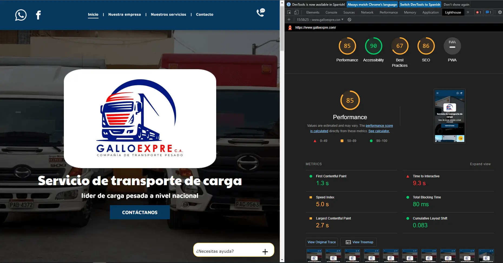
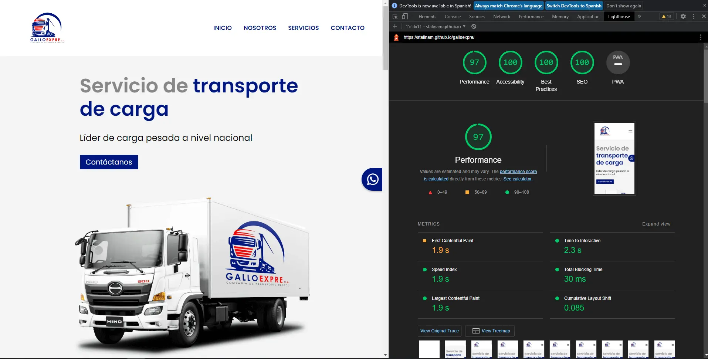

# GalloExpre C.A.

This website is an improved version in performance, accessibility, best practices and SEO.

- We omitted to add many images as in the original version as they were low quality images and which are in the social networks of the company.

- We added responsive design for different screen sizes since in the original version if the browser size is modified it does not adjust properly to that size.

Before 

After 

## Overview

### Links

- [original website](https://www.galloexpre.com/)
- [optimized website](https://stalinam.github.io/galloexpre/)

## My process

### Built with

- [Vitejs](https://vitejs.dev/)
- [React.js](https://reactjs.org/)
- [Styled-components](https://styled-components.com/docs/basics)

## Author

- GitHub - [StalinAM](https://github.com/StalinAM)
